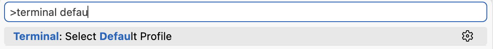

# Git basics

In this hands-on session you will learn the **local, single-track workflow** of Git: how to create a project, turn it into a repository, write a small analysis script, and record your work as a series of commits.

By the end of the workshop you should be able to:

- [ ] Initialise a Git repository and check status
- [ ] Use the core edit → stage → commit cycle with confidence
- [ ] Explain the difference between the working directory, the staging area, and the repository
- [ ] Read back your history and inspect what changed between versions
- [ ] Write and run a small test alongside your script, and version it with Git

We will work inside Positron and use the built in terminal but you could run all commands in the terminal of your choosing (except for Windows users who should use Git bash)

## Create a new project

1. Open the Positron app. If an recent session opens up, click `File` → `Open New Window`
2. Click `New folder` → `Empty Project` and select where you want to store your project. Leave `Initialize Git repository` unchecked for now
3. Select `TERMINAL` in the tab section. 

??? note "Windows users, use Git bash"

    Open a new terminal session by clicking on the little `arrow` next to the `+` select Git bash.

    If your default terminal is not Git Bash. Open command prompt `Ctrl+Shift+P` and start typing `Terminal default` open `Terminal: Select Default Profile` and select Git bash.

    {width="50%"}

??? tip "Check your location"
    You see your username and the current folder name. To see full location run `pwd` and to list all files in the folder run `ls`. There should be no files yet.


Now let's turn the folder into a Git repository:

```sh
git init
```

`git init` creates the hidden `.git` directory — the database that stores your entire history. You never edit inside it by hand. Run `ls -a` to list all content including hidden, you should see a `.git` folder

!!! tip "Check your git location"
    Run `git status` right after `git init`. Git replies with `On branch main` (or `master`) and `No commits yet`. That confirms you are inside a fresh repository.

## Configure Git once per machine

Before your first commit, tell Git who you are. This information is written into every commit so the history can show who did what.

```sh
git config --global user.name  "Your Name"
git config --global user.email "you@example.com"
```

Use the same email you will later use for GitHub so your commits are attributed correctly. The `--global` flag saves this for every repository on your machine; omit it to set it only for the current project.

??? note "Already configured?"
    See your current settings with `git config --list` or just `git config user.name`.

## Create your first script :material-file-plus:

We will build a tiny analysis script. Choose **R** or **Python** — both tracks are equivalent for the Git lessons. The script should do something small but real: read a couple of numbers, compute a summary, and print it.

=== "R (analysis.R)"

    ```r
    # analysis.R
    # A tiny descriptive-stats script used to practise Git.

    values <- c(4, 8, 15, 16, 23, 42)

    mean_value <- mean(values)
    max_value  <- max(values)

    cat(sprintf("Mean: %.2f\n", mean_value))
    cat(sprintf("Max:  %d\n",   max_value))
    ```

=== "Python (analysis.py)"

    ```python
    # analysis.py
    # A tiny descriptive-stats script used to practise Git.

    values = [4, 8, 15, 16, 23, 42]

    mean_value = sum(values) / len(values)
    max_value = max(values)

    print(f"Mean: {mean_value:.2f}")
    print(f"Max:  {max_value}")
    ```

Run it to confirm it works:

=== "R"

    ```sh
    Rscript analysis.R
    ```

=== "Python"

    ```sh
    python analysis.py
    ```

Both should print a mean around `18.00` and a max of `42`.

??? note "'Rscript' is not recognized?"
    Installing R on Windows doesn't automatically add R (and the function `Rscript`) to your terminal. Windows users are more tech-savvy than the Unix-people and can manage their own global environment. To add R to your system environment so you can run any `Rscript` directly from terminal:

    0. Find your R installation - it's *probably* something like: `C:\Program Files\R\R-4.5.2\bin` but make sure to use the path valid on **your** computer.
    1. Press `Win + R`, type `sysdm.cpl`, press Enter.
    2. Go to Advanced tab → Environment Variables.
    3. Under User variables (or System variables for all users), select Path → Edit.
    4. Click New and add **your** R path, something like:
     `C:\Program Files\R\R-4.5.2\bin`
    5. Click OK on all dialogs, then open a new terminal (PATH changes don't apply to already-open shells).
    6. Test by typing `Rscript --version` in a new terminal.

## The core cycle: status, add, commit

Git does **not** record your files automatically. You decide what becomes part of history in three steps.

### 1. See what changed — `git status`

```sh
git status
```

Right now Git tells you `analysis.R` (or `analysis.py`) is **untracked** — Git sees the new file but is not yet recording it.

### 2. Stage changes — `git add`

Staging is the act of selecting *exactly* what the next commit should contain.

```sh
# Stage a single file
git add analysis.R
```

??? top "Useful `git add` arguments:"

    | Command | What it does |
    | --- | --- |
    | `git add <file>` | Stage one specific file |
    | `git add .` | Stage all changes in the current folder and below |
    | `git add -A` | Stage all changes anywhere in the repo (new, modified, deleted) |
    | `git add -p` | Stage changes **hunk by hunk**, so you can split edits into separate commits |

After staging, run `git status` again — the file now appears under *Changes to be committed*.

### 3. Record a snapshot — `git commit`

```sh
git commit -m "Add first descriptive-stats script"
```

The `-m` flag lets you write the commit message directly. Write messages in the **imperative mood** describing what the commit *does* (e.g. "Add…", "Fix…", "Remove…").

??? tip "Useful `git commit` arguments:"

    | Command | What it does |
    | --- | --- |
    | `git commit -m "msg"` | Commit staged changes with a message |
    | `git commit -a -m "msg"` | Auto-stage modified/deleted tracked files, then commit (skips `git add` for already-tracked files) |

??? warning "What happens if you don't add a commit message?"
    An (annoying) terminal editor (vim) opens and you will be forced to add something.

    You can change the default editor with `git config --global core.editor <editor>`

    If you quit the editor changes are not committed.
    `Aborting commit due to empty commit message.` 

??? task "Exercise 1.1 — Make a change and commit it"

    1. Edit your script so it also reports the **minimum** value.
    2. Run the script and confirm the new output is correct.
    3. Stage and commit the change

    ??? help "Help"

        ```R
        ...
        min_value = min(values)

        ...
        ```
        ```sh
        Rscript analysis.R
        ```

        ```sh
        git add analysis.R
        git commit -m "Report minimum value in summary"
        ```

    Confirm there are now two commits (see next section).

## Reading back your history

```sh
git log
```

Shows every commit in reverse chronological order, with its hash, author, date, and message.

??? tip "Helpful `git log` arguments:"

    | Command | What it shows |
    | --- | --- |
    | `git log --oneline` | One compact line per commit (short hash + message) |
    | `git log -n 3` | Only the last 3 commits |
    | `git log --stat` | Which files changed in each commit |
    | `git log -p` | The full diff (line-by-line changes) of each commit |

??? task "Exercise 1.2  `git diff` — what changed but is not yet staged"

    1. Add some random values to the vector/list
    2. Check unstaged changes

    Compares your working directory against the staging area.

    ??? tip "Useful `git diff` arguments:"
        | Command | What it compares |
        | --- | --- |
        | `git diff` | Working directory ↔ staging area |
        | `git diff --staged` | Staging area ↔ last commit (what you are about to commit) |
        | `git diff HEAD~1` | Working directory ↔ the previous commit |
        | `git diff <hash1> <hash2>` | Two specific commits |

### `git show` — inspect one commit

```sh
git show
```

Shows the most recent commit's metadata and its diff. Add a commit hash to inspect any specific commit:

```sh
git show <commit-hash>
```

??? task "Exercise 1.3 — Inspect your work"

    1. Get an overview of your commits
    2. Compare the differences between your commits
    3. Check the full content of your first commit

    ??? help "Help"
        1. Run `git log --oneline` and confirm you see both commits.
        2. Run `git diff HEAD~1` to see what the latest commit changed compared with the one before it.
        3. Run `git show HEAD~1` to read the full content of your first commit.

??? task "Exercise 1.4 — Make a commit without a commit-message"

    1. In your script, make any changes you want
    2. Stage the changes
    3. commit but do not add a commit message and see what happens

??? task "Bonus quests"

    1. Find the short hash of the current commit.
    2. Show your commit history on one line with dates and times.
    3. Make a change to your script, stage it, then unstage it without losing the edit.
    4. Make two different edits in your script. Stage only one part of the changes, then check what is staged and unstaged.
    5. Find the commit where you added the minimum value. Inspect its message and the changes it made.
    6. Compare your current script with the version from your first commit. What has changed?
    7. Add a short comment to your script, commit it, then use the history to find when you made that change.

    ??? help "Help with bonus quests"
        1. Run `git log --oneline`; the short hash is the code at the start of the line for your latest commit.
        2. Run `git log --oneline --date=local --format="%h %ad %s"`.
        3. After staging a change, run `git restore --staged analysis.R` (or `analysis.py`). The edit remains in your file, but is no longer staged. Confirm with `git status`.
        4. Run `git add -p analysis.R` (or `analysis.py`) and choose which change to stage. Then run `git diff --staged` to inspect staged changes and `git diff` to inspect unstaged changes. If you prefer not to use interactive prompts, make two separate edits and stage the whole file with `git add analysis.R` (or `analysis.py`), then inspect it with `git diff --staged`.
        5. Look through `git log --oneline` for the commit message from Exercise 1, then run `git show <commit-hash>` using its hash.
        6. Run `git diff <first-commit-hash> HEAD -- analysis.R` (or `analysis.py`). Find the first commit's hash with `git log --oneline`.
        7. Run `git log --oneline` to find the new commit. For more detail, inspect it with `git show <commit-hash>`.

## Recap of the commands you learned

| Command | Purpose |
| --- | --- |
| `git init` | Create a repository in the current folder |
| `git config --global user.name/email` | Set your identity (once per machine) |
| `git status` | Show untracked, staged, and unstaged changes |
| `git add <file>` / `.` / `-A` / `-p` | Stage changes for the next commit |
| `git commit -m "msg"` | Save a snapshot with a message |
| `git log` / `--oneline` / `-p` | Browse history |
| `git diff` / `--staged` | Inspect changes before/after staging |
| `git show <hash>` | View one commit in detail |

!!! success "What you can now do"
    You can start a project, write an R or Python script, back it up as meaningful commits and check your history — all locally, with no branches or remotes involved.
