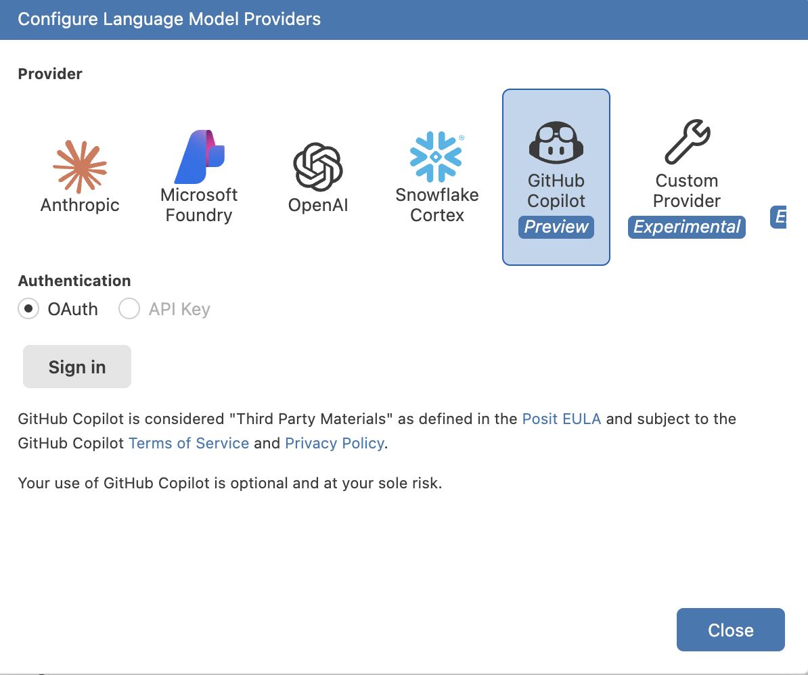
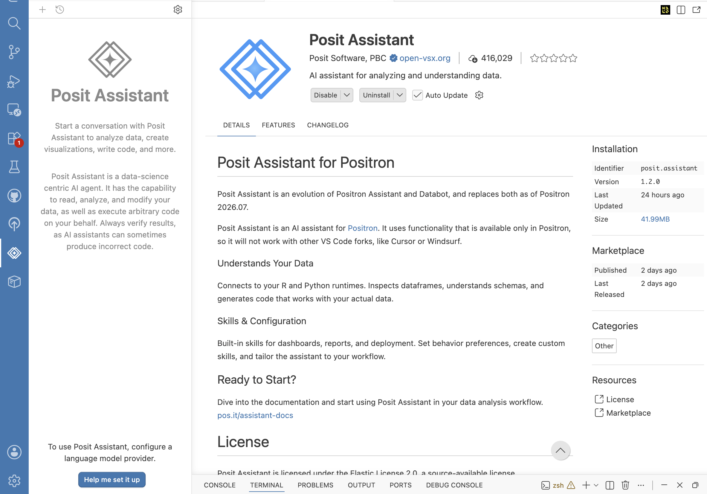

- Format: Lecture
- Teacher: -

## Summary

AI coding tools have gone from a novelty to a default part of most developers' — and increasingly researchers' — daily workflow. Used well, they remove friction: boilerplate gets written faster, unfamiliar functions get explained on the spot, and a stuck error message can be debugged in seconds instead of a ten-tab web search. Used carelessly, they can quietly introduce bugs, leak sensitive data, or produce code you cannot actually explain in your examination seminar.

This lecture gives you the vocabulary to talk about these tools precisely — starting with the distinction between an **LLM** and an **AI agent** — a tour of the tools you will actually see in Positron (**GitHub Copilot**, Positron's own **Posit Assistant**, and the agentic extension **Kilo Code**), and then the practical part: how to prompt effectively, a code of conduct for using these tools in coursework and research, and how to manage cost and resources so a session does not spiral out of control.

## What is a Large Language Model (LLM)?

A **Large Language Model** is a neural network trained on enormous amounts of text — including a large share of publicly available source code — to do one thing: predict the most plausible next piece of text ("token") given everything before it. Ask it to complete a function, and it produces the tokens that statistically look like a good continuation, one at a time, until it decides to stop.

This has three important consequences:

- **It has no built-in concept of "correct."** An LLM does not run your code, check your data, or verify a citation — it generates text that *resembles* a correct answer, based on patterns in its training data. This is why LLMs occasionally **hallucinate**: confidently producing a plausible-looking function name, package, or fact that does not exist.
- **Its knowledge has a cutoff.** A model only knows what was in its training data up to a certain date. It will not know about a package released last week, or an API that changed last month, unless that information is explicitly given to it in the conversation.
- **On its own, it cannot *do* anything.** A raw LLM only turns text into more text. It cannot read your project's files, run your script, or open a browser — unless something else gives it those abilities. That "something else" is what turns an LLM into an **agent**.

!!! info "Hallucination is a feature of how LLMs work, not a rare glitch"
    Because the model is always producing the *statistically most plausible* continuation, a wrong answer is generated with exactly the same fluent confidence as a right one. This is precisely why you must always verify AI-generated code rather than trust it because it "sounds right" — a theme this whole lecture returns to.

## From LLM to AI agent

An **AI agent** is an LLM wired into a loop with **tools**: the ability to read and write files, search a codebase, run a terminal command, browse the web, or call other programs — and to *observe the result* of each action before deciding what to do next. Where a plain LLM produces one block of text and stops, an agent can plan a multi-step task, execute a step, look at what happened (a test failure, a file's contents, a command's output), and adjust its next step accordingly, continuing until the task is done or it asks you for input.

| | Large Language Model (LLM) | AI agent |
| --- | --- | --- |
| **What it does** | Predicts and generates text (or code) from a prompt | Plans and executes a sequence of actions using tools, observing results between steps |
| **Can it read your project?** | Only what you paste into the prompt | Can open, search, and read files itself |
| **Can it change things?** | No — it only returns text for *you* to apply | Can write files, run terminal commands, and (if allowed) commit changes directly |
| **How it recovers from a mistake** | It does not — the conversation just continues | It can see the error (e.g. a failing test) and try again automatically |
| **Example** | Asking ChatGPT in a browser tab "how do I sort a list in R?" | Asking an assistant inside your editor to "add a test for this function, run it, and fix it until it passes" |

Both GitHub Copilot's inline autocomplete and a one-off question to a chat model are examples of the **LLM** end of this spectrum. Copilot's newer agent mode, Positron's **Posit Assistant**, and extensions like **Kilo Code** sit at the **agent** end — they read your repository, make edits across multiple files, run commands in your terminal, and iterate, all with your supervision.

??? question "If agents can act on their own, why do they still need supervision?"
    An agent is still, underneath, an LLM at every decision point — it can misjudge which file to edit, run a destructive command, or declare a task "done" when it is not. Its tools make mistakes more *consequential*, not less likely. Every mainstream agentic tool therefore asks for your approval before risky actions (editing files, running commands, committing, or pushing), and you are expected to review what it proposes rather than click "accept" reflexively.

## Some examples of AI coding tools

Positron, being built on the same foundation as VS Code, supports the same category of AI extensions you would find there. You will typically meet three flavours:

### GitHub Copilot — inline completion and chat

**Copilot** is the most widely used AI coding tool, and the one already mentioned in the Positron session. In its simplest form it works as **inline autocomplete**: as you type, it suggests the rest of the line, or the whole function, in a greyed-out "ghost text" you accept with <kbd>Tab</kbd> or ignore by continuing to type. Its **chat** panel lets you ask questions about your code, request explanations, or ask it to generate a snippet you paste in yourself. Newer "agent mode" features in Copilot add the multi-file, multi-step behaviour described above, but its core strength remains fast, low-friction, line-by-line completion while you write.

!!! tip "If you [register on github with your KI-email](../setup/github-setup.md#use-a-university-email-or-github-student-developer-pack) you can get a new (but limited) batch free tokens every month."

### Posit Assistant — Positron's built-in AI panel

Positron ships with its own AI panel, **Posit Assistant**, reachable from the activity bar. Rather than locking you into one AI provider, it lets you connect the language model of your choice — Anthropic, OpenAI, Microsoft Foundry, Snowflake Cortex, GitHub Copilot, or a custom endpoint — from a single settings screen:

{ width="70%" }

Posit Assistant is explicitly built for data science: it can inspect your R and Python runtime, look at the actual shape and contents of your data frames, and generate code that matches your real data rather than a generic guess. Because it can execute code and modify files on your behalf, it behaves as an **agent** in the sense defined above — and, as its own description puts it plainly, you should "always verify results, as AI assistants can sometimes produce incorrect code."

{ width="70%" }

### Kilo Code — an open, agentic coding assistant

**Kilo Code** is an open-source AI coding agent, distributed as an editor extension, that focuses only on the agentic end of the spectrum. Rather than only suggesting text, it can plan a task into steps, read and edit multiple files across your project, run terminal commands, and check its own work (for example, running your test suite after making a change) — asking for your approval at each consequential step. It is provider-agnostic, meaning you (or your institution) choose which underlying LLM powers it. Because it is open-source, its behaviour is inspectable rather than a black box, which matters if you want to understand exactly what it is capable of doing to your repository before you grant it permission.

| Tool | Best for | Interaction style |
| --- | --- | --- |
| GitHub Copilot | Fast, in-the-moment completions while typing; quick chat questions | Inline ghost text; chat sidebar; optional agent mode |
| Posit Assistant | Data-aware help inside Positron: inspecting data frames, writing analysis code | Chat panel, multi-provider, can execute code and edit files |
| Kilo Code | Larger, multi-step tasks: refactors, adding tests, working across several files | Agentic: plans, edits, runs commands, iterates with your approval |

None of these tools are mutually exclusive — many developers keep an inline completion tool running for small suggestions and reach for an agent only when a task is large enough to be worth planning out.

## Effective prompting

The quality of what you get back is directly shaped by the quality of what you put in. A vague prompt gets a vague, generic answer; a prompt with the right context and constraints gets something close to what you actually need on the first try.

| Feel | Example prompt | Why it misses or hits |
| --- | --- | --- |
| :cold_face: **Too little** | `fix this` | No file, no error message, no expected behaviour — the model has to guess what "this" even is. |
| :fire: **Too much** | *(pastes an entire 2,000-line script, three unrelated error messages, and the whole dataset, then asks "why doesn't this work")* | Buries the actual problem in irrelevant context; large pastes also burn through the model's context window and your token budget for no benefit. |
| :bear: **Just enough** | `In analysis.R, the summarize() function on line 12 throws "non-numeric argument" when I call it with the values c(4, 8, NA). Update it to ignore NA values and add a test for that case.` | States the file, the function, the exact error, the trigger, and the desired fix — the model can act immediately. |

Some concrete habits that consistently improve results:

- **Give it the error message, not a paraphrase.** Copy the exact traceback or error text; models are very good at pattern-matching real errors and much worse at guessing from a vague description.
- **Point at the file and function, not "the code."** Open the relevant file, or name it explicitly, so the tool (or you, pasting into a chat) is not guessing which of your scripts is involved.
- **State the constraint, not just the goal.** "Add a function that also works with missing values" is better than "make it better" — it tells the model what "better" means.
- **Ask for tests alongside the fix.** Requesting `... and add a test that would have caught this` turns every fix into a small, verifiable safety net, echoing the red→green→commit habit from the testing session.
- **Break large tasks into steps.** "Refactor the whole pipeline" invites a huge, hard-to-review diff. "First extract the cleaning steps into a function, then I'll ask you to add tests" keeps each change reviewable.
- **Iterate instead of restarting.** If the first answer is close but not right, tell the tool specifically what is wrong rather than discarding the conversation — it has the context of what it already tried.
- **Always read the diff before accepting it.** Whether it is a Copilot suggestion or a Kilo Code multi-file edit, review what actually changed the same way you would review a colleague's pull request.

## Code of conduct: using LLMs as coding assistants

AI coding tools raise the same questions as any other powerful, largely reliable but occasionally-wrong collaborator. The following rules apply throughout this course, and are good practice well beyond it:

!!! warning "You are responsible for every line you commit"
    Accepting an AI suggestion does not transfer responsibility for it. If code you accepted is wrong, insecure, or fabricates a result, **you** are accountable for it in your project and your examination — "the AI wrote it" is not a defence. Treat every suggestion as a draft from a fast but fallible collaborator, not as a finished answer.

- **Never paste sensitive data into a cloud-hosted tool.** Participant data, unpublished results, credentials, and API keys should not go into a prompt sent to an external provider, for the same reason they should never be committed to Git (see the [remote and safety lecture](git-lectures-remote.md)) — once sent, you generally cannot guarantee it was not retained. Prefer synthetic or already-public example data when asking for help with a data-shaped problem.
- **Verify before you trust.** Run the code. Run the tests. Check that a cited function, package, or argument actually exists. A model's fluent, confident tone is not evidence of correctness (see hallucination, above).
- **Understand what you commit.** If you cannot explain what a suggested block of code does, do not commit it — ask the tool to explain it first, or rewrite it yourself until you can.
- **Disclose AI use where it is expected.** Follow your course's, your institution's, and any journal's policy on declaring AI assistance. Academic integrity expectations apply to AI-assisted work exactly as they do to work copied from any other source.
- **Keep the reasoning yours.** AI tools are well suited to writing mechanical code — parsing, plotting boilerplate, test scaffolding. The scientific interpretation of your results, and the judgement calls about your analysis, should remain your own reasoning, not a generated paragraph you did not critically evaluate.
- **Respect licensing.** Code suggested by a model can resemble licensed code it was trained on. Do not blindly paste large, distinctive blocks of suggested code into a public repository without considering where it might have come from.
- **Use it to learn, not to skip learning.** Asking "explain why this works" is a good use of these tools during a course; asking it to produce an assignment you do not understand defeats the purpose of doing the assignment at all.

## Managing resources efficiently

Agentic tools in particular can consume a surprising amount of **context** (how much text the model can consider at once) and, if you or your institution pay per request or per token, real **cost**. A few habits keep sessions efficient and affordable:

- **Do not dump the whole repository into a prompt.** Point the tool at the specific file or function instead of pasting everything "just in case" — most editor-integrated tools can already open and search files themselves, so you rarely need to paste large chunks manually.
- **Keep tasks scoped.** A tightly scoped request ("add input validation to this one function") finishes faster and cheaper than an open-ended one ("improve this codebase"), and produces a diff you can actually review.
- **Match the tool to the task.** Simple, mechanical edits (renaming a variable, writing a boilerplate function) do not need your most expensive or most "reasoning-heavy" model or mode — save the larger, slower models for genuinely hard problems, and let quick inline completion handle the rest.
- **Close or stop sessions you are not using.** An idle agent session can still hold open context (and, for some tools, background processes); stop it when you are done with a task rather than leaving several running at once.
- **Watch usage where it is visible.** Most providers and extensions expose some usage or cost dashboard — check it occasionally so a runaway loop or an oversized context does not become a surprise bill or a blown quota.
- **Let `.gitignore` do double duty.** Large data files and generated output that you already exclude from Git (see the [remote and safety lecture](git-lectures-remote.md)) are usually exactly the files you also do not want an agent indexing or reading into its context — keep both clean for the same reason.
- **Do not let an agent loop unsupervised on a long task.** Check in on multi-step tasks rather than starting one and walking away; approving each consequential step (file edits, commands, commits) as it comes keeps both cost and risk bounded.

## Why Git and AI coding assistants are so closely linked

It is not a coincidence that this course puts Git and AI assistance back to back. An agent that can edit multiple files and run commands is, by construction, a tool that can make mistakes across your whole project in seconds — and Git is precisely the safety net that makes accepting that risk reasonable.

- **Git is the undo button that lets you say yes.** Because every committed state is recoverable, you can let an agent attempt a multi-file refactor knowing that a bad result is one `git restore`, `git checkout -- .`, or `git revert` away rather than a manual rebuild from memory. Without version control, the same agentic edit would be a gamble; with it, it is a reviewable, reversible experiment.
- **"Read the diff before accepting" *is* a Git skill.** The review habit from the prompting section above — checking what an agent actually changed before you keep it — is the exact same skill as reviewing a colleague's pull request in the [collaboration lecture](git-lectures-collaboration.md). `git diff` (or your editor's diff view) is the tool that turns "the agent said it fixed it" into something you can actually verify, line by line.
- **Small, frequent commits protect you from AI mistakes too.** The habit of committing in small, working steps (from the version-control lectures) means that if an agent's third edit in a row breaks something, you can isolate exactly which step did it and roll back only that one — instead of untangling one enormous, mixed diff.
- **Agents increasingly use Git themselves.** Many agentic tools, Kilo Code included, can stage, commit, branch, or even open a pull request as one of their available actions, not just edit files. Supervising an agent that can run `git commit` on your behalf requires the same judgement as supervising any collaborator who can push to your repository — you approve what it stages, the same way you would review any other change before it becomes part of your history.
- **History is context an LLM does not otherwise have.** A model's context window is limited and resets between sessions, but your commit history, messages, and diffs persist. Good commit messages and a clean history are not just good practice for your human collaborators — they are also the record an AI tool reads to understand *why* the code looks the way it does, which is only useful if that history is legible in the first place.

??? tip "Treat an agent's changes like an unreviewed pull request"
    Before you let an agentic tool commit on your behalf, consider asking it to stop at the staged-changes step so you can inspect `git diff --staged` yourself first — the same discipline as reviewing a PR before merging it, just compressed into a single working session.

## The environmental cost of AI

Every prompt you send has to be computed somewhere, on hardware that draws real electricity. This is not a reason to avoid these tools — it is a reason to use them deliberately, the same way you would avoid running an unnecessary loop in your analysis code.

A peer-reviewed 2025 study modelling AI adoption across the entire US economy quantified this:

- Widespread AI adoption is projected to raise US energy use by roughly **28 petajoules (≈7.8 TWh) per year** and CO2 emissions by about **897 kilotonnes of CO2 per year** — a scale of emissions comparable to the total annual output of a small country such as Iceland.
- In relative terms this is small: about **0.03% of US energy use** and **0.02% of US CO2 emissions** — but it is not zero, and it is distributed unevenly. Energy-intensive industries such as education saw disproportionately large impacts compared with, for example, publishing.
- Directly, training a single large language model can use as much energy as several hundred households do in a year, but *running* the finished model for millions of everyday queries (**inference**) adds up to considerably more energy over time than training it once. As one data point, day-to-day inference for a widely used chat assistant was estimated at roughly 0.2 TWh per year.
- Meeting this growing demand requires real infrastructure: the same study estimates around **0.9 GW of additional US electricity generation capacity** is needed annually just to keep pace with AI-driven demand growth.

!!! info "Watts and bots: the energy implications of AI adoption"
    Harding, A. R., & Moreno-Cruz, J. (2025). *Watts and bots: the energy implications of AI adoption.* **Environmental Research Letters**, 20, 114084. [doi.org/10.1088/1748-9326/ae0e3b](https://doi.org/10.1088/1748-9326/ae0e3b)

    The paper models how AI-driven productivity gains ripple through energy use and emissions across 55 US industries, and cross-checks that economy-wide estimate against direct, hardware-based estimates of AI energy consumption — finding the two approaches broadly agree. Read it with the same critical eye you would apply to any source you cite in your own project: the authors disclose funding from Google, and the headline numbers carry substantial uncertainty ranges, both clearly reported in the paper's own sensitivity analysis.

What this means in practice, as a *user* of these tools rather than someone training them:

- **The habits above are also environmental habits.** Scoping tasks tightly, not re-running a prompt three times to get lucky, and not leaving an agent looping unsupervised reduce your token cost and your energy footprint at the same time — efficient prompting is not only about your wallet or your quota.
- **Bigger is not always better.** Reaching for the largest, most capable model for a trivial task (renaming a variable, formatting a file) draws disproportionately more energy than using a smaller, faster model suited to the job.
- **A well-scoped prompt needs fewer follow-ups.** Getting the context right the first time (the right file, the exact error, a clear constraint) usually means fewer total requests than a vague prompt that has to be refined repeatedly — good prompting and lower energy use point the same direction.

## Summary

- An **LLM** predicts plausible text one token at a time and has no built-in way to verify, execute, or fact-check what it produces.
- An **AI agent** is an LLM connected to tools — reading and editing files, running commands — that lets it plan and carry out multi-step tasks, observing results as it goes.
- **GitHub Copilot** excels at fast inline completions and chat; **Posit Assistant** and **Kilo Code** sit further on the agentic end, editing multiple files and running commands with your approval.
- Effective prompts are specific: the right file, the exact error, a clear constraint, and a request for tests — not a vague instruction or an entire codebase pasted in at once.
- The code of conduct is simple to state and easy to forget under deadline pressure: you remain responsible for everything you commit, sensitive data never goes into a cloud prompt, and every suggestion is verified before it is trusted.
- Efficient use — scoped tasks, the right tool for the job, and supervised sessions — keeps both cost and risk under control.
- Git and AI assistance reinforce each other: version control is the safety net that makes accepting AI edits reasonable, and reviewing an agent's diff is the same skill as reviewing a pull request.
- AI use has a real, measurable energy and emissions footprint at the scale of a whole economy; it is currently a small fraction of total impact, but the same habits that keep your usage efficient also keep it lower.

With the concepts, the tools, and the ground rules in place, the rest of the course is a good place to practise: try prompting for a small function, a test, or an explanation as you build your mini-project this afternoon, and apply the same review habits you would apply to any other code before you commit it.
