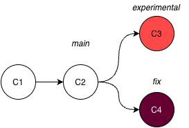
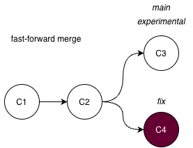
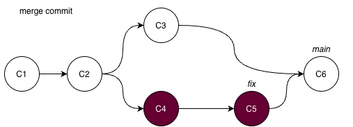

- Format: Lecture
- Teacher: Andreas

!!! todo "Content TODO :octicons-video-24:"
    This session page is a placeholder. Add learning goals,
    materials, exercises, and links here.

In the first session you worked on a single, straight line of commits. That line is already a branch — Git's default branch, usually called `main`. Branching is the feature that turns version control from a fancy undo-button into a tool for safe experimentation and real collaboration. This lecture explains *what* a branch is and *why* it matters.

## What is a branch?

Think of a branch as a parallel timeline and the main branch is the primary timeline. When you create a branch you create a portal to a parallel dimension which has been the same world up until that point, and any changes you make will diverge from the primary timeline. A commit in the parallel dimension stays in the parallel dimension, until you merge the timelines (we will come back to that).



Unlike many other version control systems, which stores new branches as separate copies of a project, a branch in Git is just a **pointer to a commit** (`HEAD`), or a label of that chain of commits. This makes it lightweight and fast to switch between branches.

When you make a new commit while on a branch, Git writes the new snapshot and then **moves the pointer forward** to it. Nothing is copied; only a label shifts. This is why creating a branch in Git is nearly instant and costs almost no disk space, unlike older systems that physically forked the entire directory tree.

!!! info "Visualising your multiverse"

    Visualising your project as a graph is useful as projects grow. The command `git log --oneline --graph --all` draws the structure with lines and dots, letting you see exactly how branches diverged and where they came back together. Understanding the graph is the difference between treating Git as mysterious and treating it as a clear map of your project's reasoning.

    Note `HEAD` which tells you where you, on which commit, in which branch.

## Why branch?

Because a branch is just a pointer, you can create one, move it forward with experimental commits, and — if the experiment fails — simply delete the pointer. The original line (`main`) is completely untouched. This gives you three superpowers:

- **Safe experimentation.** Try a new analysis on a branch. If it works, merge it; if it does not, throw the branch away.
- **Parallel work.** Different features or fixes can progress independently on separate branches without stepping on each other.
- **Collaboration.** Each contributor can work on their own branch and combine their work later through merges.

For researchers this is especially valuable: you can keep a clean, working `main` while exploring analyses that may never pan out, without polluting the version you trust.

## The commit graph

Once you have more than one branch, history is no longer a straight line — it becomes a **directed acyclic graph (DAG)**. Each commit points back to its parent(s). A commit created by a merge has *two* parents: one from each branch being joined.

## Create a new branch

Creating a branch is just pinning a new label to the commit you are on right now — `HEAD`. Because a branch is only a pointer, the act of creating one is instant and costs nothing; no files are copied.

To create a new branch simply run `git branch experiment`. Note that you will stay on the working branch until you switch.

Optionally you can run `git switch -c experiment`, to both create the branch *and* move onto it in one step:

The `-c` flag means "create the branch if it does not exist, then switch to it". After running it, `git status` reports `On branch experiment`, and any new commits you make now advance the `experiment` pointer while `main` stays exactly where it was. In practice, creating and switching together is what you will do most often.

## Switching branches

To list all your local branches run `git branch` or `git branch --list`. This only shows you local branches. Run `git branch --remotes/-r` for remotes only or `git branch --all/-a` for both local and remote.

Once a branch exists, move onto it with `git switch`:

```sh
git switch main
```

Git rewires `HEAD` to point at the `main` branch, and your working directory is updated to match that branch's commit. This is the "step through the portal" moment: you are now standing in a different timeline, and the files on disk reflect that dimension's state. Switching is fast for the same reason branching is — Git only has to move a pointer and update the files that actually differ.

To not destroy your work, Git by default does not allow you to switch to a branch if you have uncommitted changes that may conflict with the other branch. If you need to switch between branches without committing to changes there are ways around but we will not go into that here, but run `git stash --help` if you want to know more.

!!! info "Switching branches change what you see"
    By switching a to a new branch your working directory is updated and will only show the snapshot from where you are right now. So don't panic if you can't find a file, you might just be in the wrong branch.

??? question "What is the difference between `git switch` and `git checkout`?"

    The older command `git checkout -b experiment` does the same thing as `git switch experiment`, but we avoid `checkout` here because it is overloaded (it also restores files), which makes it easy to misuse.

    `git checkout` has always done two different jobs: **switch branches** (`git checkout main`) *and* **restore files from history** (`git checkout -- analysis.R`). That overlap caused accidents — people meant to switch branches and overwrote a file instead. So in **Git 2.23 (2019)** the command was split:

    - **`git switch`** → *only* switches branches (safe, single-purpose).
    - **`git restore`** → *only* restores/undoes file changes.

    Practical differences:

    - For normal branch switching they behave the same: `git switch main` ≡ `git checkout main`.
    - `git switch` **refuses detached HEAD by default** — `git checkout <hash>` silently drops you into detached HEAD, while `git switch` makes you opt in with `git switch --detach <hash>`. That protects you from "where did my branch go?".
    - `git switch` **can't touch files** — there is no `git switch -- file`; file restoration is now `git restore`. So `git switch` will never accidentally clobber your working files.

    **Rule of thumb:** use `git switch` to move between branches and `git restore` to undo file changes. You will still see `git checkout` in older docs and Stack Overflow — when you do, read it as *"either switching a branch or reverting a file."*

## Merging: bringing work back together

If you events (commits) in your parallel experimental timeline proves successful, at some point you want the branch timeline to rejoin the primary timeline, so that every event from the side-quest becomes part of the main story. This is called a **merge**. The **merge** can play out in two ways:


**Fast-forward merge — the primary timeline stood still.** If `main` hasn't moved since you forked off, your parallel timeline is simply *ahead* of it. Rejoining needs no new event: Git slides the `main` pointer forward along your line until it catches up to your latest commit. The histories were always one straight line; the merge just catches the prime timeline up to where the branch already was — no paradox, no new reality.


  
**Merge commit — both timelines moved.** If `main` also collected its own events while you were away, the timelines have genuinely diverged and can't be collapsed into one straight line. Git writes a brand-new **convergence event** — a merge commit with *two parents*, one from each timeline. This commit is the moment the two realities fuse; from it you can see exactly where the branch split off and where it came back.



The `--no-ff` flag forces that convergence event even when a fast-forward would work. Many prefers it because it leaves a visible "seam" in history — proof that this block of work came from a dedicated branch, which makes the merged story easier to read later.

??? question "What happens to the parallel timeline after a merge?"
    Nothing is erased. The branch pointer (the portal) still exists and still points at its last event — only `main` has now advanced to include those events too. You can keep committing on the branch and merge again, or close the portal with `git branch -d` once you no longer need that reality. A merge *joins* timelines; it does not destroy them.

    It is generally good hygiene not open too many portals (branches) without deleting as this may clutter your working tree and make the project difficult to overlook. 

    If your experiment branch did not work as expected and you don't want to merge it with the main branch you can delete it. The commits will still be saved, but not visualised and you need to know the hash to be able to see them.

## Merge conflicts

A conflict is not an error — it is Git being honest that it cannot automatically decide between two competing changes. It happens when the same lines of the same file were changed on both branches. Git pauses the merge and asks a human to choose, marking the conflicting region directly in the file with `<<<<<<<`, `=======`, and `>>>>>>>` markers. Resolving a conflict is simply editing the file down to the version you want, staging it, and committing. This is easiest done inside Positron (or other IDEs) and tools to resolve merge conflicts.

The key insight is that conflicts are a *sign of parallel progress*, not a mistake. They are far easier to handle in small, frequent merges than in rare, massive ones — which is why short-lived branches that are merged often are a best practice.

## Summary

- A branch is a movable pointer to a commit, not a copy of your files.
- Branching enables safe, isolated, parallel work on top of a trusted `main`.
- History is a graph; `git log --graph` lets you see it.
- Merges join branches — either by fast-forward or by a merge commit.
- Conflicts are expected and resolvable; merge often to keep them small.

In the workshop you will create branches, merge them, and resolve a conflict by hand. The conceptual model above is what makes those steps make sense rather than feel like incantations.
