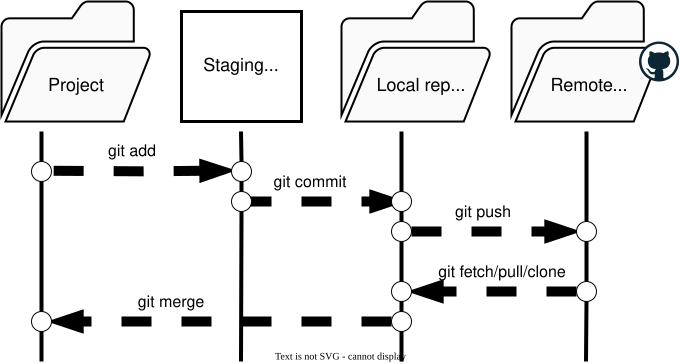

- Format: Lecture
- Teacher: Andreas

!!! todo "Content TODO :octicons-video-24:"
    This session page is a placeholder. Add learning goals,
    materials, exercises, and links here.

So far every commit has lived only on your own machine. That is great for privacy, but it means your work is one spilled coffee away from being lost, and it cannot be shared or collaborated on. A **remote** solves both problems — but it also introduces risk, because whatever you push can be seen by others, and on a public remote it can be seen by *everyone*. This lecture covers the concepts of remotes, and the safety practices — `.gitignore`, secret-handling, and SSH — that keep you from sharing what you did not mean to.

## What is a remote?

A **remote** is just a saved reference — a URL — to another copy of your repository. Git stores it under a short name, by convention `origin`. Adding a remote does not copy anything; it only tells Git *where* `origin` points. The actual copying happens later, explicitly, when you `push` (send your history out) or `pull`/`clone` (bring history in).



Because Git is distributed, every clone is a full repository with its own complete history. A remote is not a "master" server in the traditional sense — it is simply a convenient, shared meeting point that everyone agrees to push to and pull from. This is why GitHub going down does not destroy your history: your local copy is intact.

## The danger: what gets committed, stays committed

The single most important safety rule is this: **once a file is committed and pushed, assume it is permanent and, on a public remote, public.** Even if you delete the file in a later commit, the data still exists in earlier commits in the history. This has two consequences:

1. Be deliberate about what you `git add` in the first place.
2. Never put credentials, tokens, or private data into a commit at all.

The remedy is not "delete it later" — it is "never let it in." That is the job of `.gitignore` and good secret-handling habits.

## `.gitignore`: deciding what Git never sees

A `.gitignore` file lists patterns for files Git should **not track** — operating-system noise (`.DS_Store`), editor temp files, generated outputs, and, critically, secrets. It lives in the root of your repository and is committed itself, so the rules travel with the project and apply to everyone who clones it.

The mental model: `.gitignore` is a filter at the *entry* to your repository. Files matching its patterns never reach the staging area, never get committed, and therefore never get pushed. You can always verify a rule with `git check-ignore -v <file>`, which reports exactly which line caused a file to be ignored.

For a research project, a good `.gitignore` typically excludes:

- OS and editor junk (`.DS_Store`, `.Rhistory`, `__pycache__/`)
- Regenerable outputs (`/results/`, `*.png`, `*.csv`)
- Secrets (`.env`, `*.key`, `credentials.json`)

The principle: **commit source and documentation; ignore data, outputs, and secrets** (unless a specific data file is itself the curated research output, which is a separate decision).

## Secrets: keep them out of Git entirely

API keys, tokens, and passwords must never enter version control. The safe pattern is to store them in a file *outside* Git — conventionally `.env` — and add that file to `.gitignore`. Your script then reads the value from the environment at runtime rather than from a committed file:

=== "R"

    ```r
    token <- Sys.getenv("GITHUB_TOKEN")
    if (token == "") stop("Set the GITHUB_TOKEN environment variable")
    ```

=== "Python"

    ```python
    import os
    token = os.environ.get("GITHUB_TOKEN")
    if not token:
        raise RuntimeError("Set the GITHUB_TOKEN environment variable")
    ```

If a secret is *accidentally* committed, the correct response is to **treat it as compromised and rotate/revoke it immediately**. Removing it in a later commit does not remove it from history; truly purging it requires rewriting history (with tools like `git filter-repo` or the BFG Repo-Cleaner) and a force-push. Prevention is dramatically simpler than cleanup.

## SSH keys: proving who you are without a password

To push to GitHub you must prove your identity. HTTPS remotes ask for a username and a personal access token on every push — workable, but tedious. **SSH keys** provide a smoother and more secure alternative.

An SSH key pair has two parts: a **private key** that stays on your machine and must never be shared, and a **public key** that you register with GitHub. When you push, your machine uses the private key to prove it holds the matching pair; GitHub checks it against the public key you registered. No password is transmitted, and the private key is never sent anywhere.

The safety takeaway: add only the **public** key (the file ending in `.pub`) to GitHub. Anyone who obtains your public key learns nothing useful; only the private key grants access, so it stays local and is typically protected by a passphrase.

## HTTPS vs SSH

Both protocols are valid. SSH is convenient for repeated pushing from a trusted machine and avoids storing tokens locally. HTTPS with a token is common in restricted networks and continuous-integration systems. The safety rules — ignore junk, keep secrets out, push only intended files — apply identically regardless of which you choose. You can switch a remote between them at any time with `git remote set-url`.

## Summary

- A remote is a saved URL (conventionally `origin`); pushing and pulling move history in and out explicitly.
- Committed-and-pushed data is effectively permanent and, on public remotes, public — so be deliberate.
- `.gitignore` filters files at the entry point; commit source, ignore data/outputs/secrets.
- Keep secrets in an ignored `.env` and read them from the environment at runtime.
- SSH keys authenticate passwordlessly: share only the public key, guard the private key.

The workshop will put these ideas into practice: linking a remote, writing a `.gitignore`, and setting up SSH so you can push safely.
