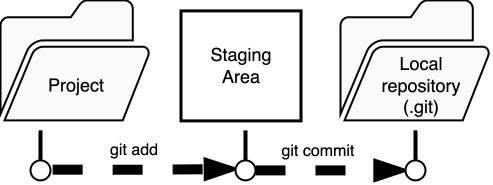

[:material-file-pdf-box: Download slides (.pdf)](downloads/1-why-git.pdf){ .md-button download="1-why-git.pdf" }

## Slides

<div class="slide-gallery" markdown="1">

</div>

## Summary

If you have ever worked on an analysis long enough, you will recognise the folder in the image below: a collection of files named `analysis_final.R`, `analysis_final2.R`, `analysis_FINAL_v3_USE_THIS.R`, and so on. Each file represents an attempt to preserve a working state before making a risky change, but without any record of what changed, when, or why. This approach breaks down quickly — it is difficult to know which version produced which result, nearly impossible to undo a specific change without losing other work, and a serious obstacle to collaboration and reproducibility.

{ align="right" width="50%"}

Git solves all of these problems systematically. Rather than duplicating files manually, Git maintains a complete and structured history of every change to your project. You can return to any previous state at any time, compare exactly what changed between two points in time, work on experimental changes without disturbing the stable version, and collaborate with others without overwriting each other's work. For researchers, this is not just a convenience: a version-controlled analysis is transparent, auditable, and far easier to share, review, and reproduce.


## Git short (version) history

Git is a **Distributed Version Control System (DVCS)** — a tool that records the full history of changes to a set of files and allows multiple people to work on those files independently and in parallel.

{ align="right" width="20%" }

Git was created by **Linus Torvalds** and his Linux team in **2005**, originally to manage the source code of the Linux kernel after the project outgrew its previous version control tool. It was designed to be fast, simple, and fully distributed, meaning that every contributor holds a complete copy of the repository and its history — there is no single point of failure.

A common point of confusion for newcomers is the relationship between **Git** and **GitHub**. Git is the version control software itself: it runs locally on your computer and has no dependency on the internet. GitHub is a commercial web platform built on top of Git that adds hosting, a browser interface, issue tracking, and collaboration features such as pull requests. You can use Git without GitHub entirely, and GitHub is just one of several hosting services — others include GitLab and Bitbucket. Think of Git as the engine and GitHub as one particular garage where you can park and share your work.
{ align="right" width="20%" }

## How does Git work

Each time you commit, Git takes a **snapshot** of your entire project — not just the lines that changed, but the full state of every tracked file at that moment. This is different from older version control systems that stored only the differences between versions. The result is that any past state of the project can be reconstructed instantly and completely.

Because every contributor holds a full copy of the repository, almost every operation Git performs — browsing history, comparing versions, creating branches, staging changes — happens entirely on your local machine with no network required. This makes Git **very fast** compared to centralised systems where each operation has to talk to a remote server.

Git also makes it practically impossible to lose or corrupt work silently. Every file and every commit is identified by a **cryptographic hash** — a long fingerprint such as `4f5a318668c47e266fd679f84b53ce2dfab08129` — computed from the exact contents of that object. If even a single character changes, the hash changes completely. Git checks these hashes automatically, so any accidental or malicious modification to the history is detected immediately. This property makes Git not just a collaboration tool but also a reliable **audit trail** for your analysis.

## The database

{ width="50%" align="right" }

When you run `git init` in a folder, or clone an existing repository, Git creates a hidden directory called `.git` inside your project folder. This is the database — it contains the entire history of your project: every commit, every version of every file, every branch, and every tag, going all the way back to the very first change ever recorded.

The `.git` directory is self-contained and portable. If you copy the folder to another machine, you bring the full history with you. If you delete a file from your project by mistake, Git can restore it from the database. If you want to see what your analysis looked like six months ago, Git reads it directly from there.

You almost never need to look inside `.git` yourself — Git commands are the interface to it. But it is useful to know it exists and what it represents: it is the single source of truth for everything Git knows about your project. The one important rule is to never edit files inside `.git` manually, as doing so can corrupt the history in ways that are difficult to recover from.

## The file change process

Understanding how Git moves changes from your editor to the permanent history is the single most important conceptual hurdle for new users. Git does not record changes automatically as you save files — it gives you deliberate control over what gets recorded, and when.

The process has three local stages:



**1. Working directory**
This is simply the folder on your computer where your project files live. When you edit a script, add a data file, or delete something, those changes exist only here. Git is aware that something has changed, but has not been asked to do anything about it yet. You can see the current state at any time with `git status`.

**2. Staging area** (also called the index)
Before a change is committed to history, you explicitly select which changes to include using `git add`. This moves the selected changes into the staging area — a preparation zone that holds exactly what your next commit will contain. The staging area lets you be precise: if you changed three files but only two of them belong to the same logical unit of work, you can stage just those two and commit them separately from the third.

**3. Repository** (the `.git` database)
Running `git commit` takes everything in the staging area and writes it permanently into the repository as a new snapshot. You provide a short message describing what the change represents and why. From this point on, the commit is part of the immutable history and can always be retrieved.

A typical cycle looks like this:

```sh
# 1. Edit files in your project as normal

# 2. Check what has changed
git status

# 3. Stage the changes you want to commit
git add analysis.R

# 4. Commit them to the history with a message
git commit -m "Add outlier removal step to preprocessing"
```

Repeating this cycle — edit, stage, commit — is the core rhythm of working with Git. Each commit is a deliberate, documented decision rather than an automatic save, which is what gives the history its value as a record of how and why the analysis evolved.

## Writing good commit messages

A commit is only as useful as the message attached to it. Weeks later, the message — not the diff — is what you (and your collaborators) skim to understand *why* a change exists. A good message is the difference between a history you can navigate and one you fear to touch.


!!! info "What is a good commit message?"
    A commit message should describe **what** changed and **why**, written from the perspective of the project after the change is applied. Aim for a single, focused unit of work per commit.
    { align="right"}

    - Use the **imperative mood**: "Add", "Fix", "Remove" — as if completing the sentence *"This commit will …"*.
    - Keep the **subject line short** (around 50 characters), capitalized, and without a trailing period.
    - Put the **why**, not the what-you-typed, in a body when the change is not obvious. The diff already shows *what*; the message should explain *why*.
    - One logical change per commit, so each message stays truthful and each commit can be reverted on its own.
    

A commit message follows the Goldilocks principle too little leaves you confused, too much buries the point, and **just enough** is exactly right.

| Feel | Example message | Why it misses or hits |
| --- | --- | --- |
| :cold_face: **Too little** | `fix` / `updates` / `stuff` | No context. Six months later you cannot tell what changed or why, and `git log` becomes useless. |
| :fire: **Too much** | `So I changed the mean function because the old one divided wrong and also I renamed some variables and updated the plot and oh also fixed a typo` | The real point is drowned in noise; nobody reads a wall of text, and the actual change is hard to spot. |
| :bear: **Just enough** | `Fix mean calculation for empty input` | States what changed and the case it fixes in one scannable, imperative line. Clear, searchable, and revertible. |

A quick test for "just enough": if a teammate read only your subject line in `git log`, would they understand the change without opening the diff? If yes, you have found the Goldilocks zone.

## How often should you commit?

If commit messages are about *quality*, frequency is about *granularity*. The short answer: **early and often, in small logical chunks** — but not so often that each commit is meaningless.

A useful rule of thumb is to commit whenever you reach a **stable, self-contained step** in your work: you finished cleaning a dataset, you got a function to pass its test, you fixed a bug. Each commit should represent one idea, so it can be understood, reviewed, and reverted on its own. If you ever catch yourself writing a message like "lots of changes" or "work in progress, don't look", that is a signal the commit is trying to hold too much — split it.

| Feel | Habit | Consequence |
| --- | --- | --- |
| :cold_face: **Too little** | One giant commit at the end of the week (`everything works now`) | You lose the trail of *how* you got there; a single bad change is hard to isolate and revert; collaborators cannot follow your reasoning. |
| :fire: **Too much** | A commit for every saved keystroke (`typo`, `another typo`, `still going`) | The history is noisy and the signal is lost; reviewing or bisecting becomes painful. |
| :bear: **Just enough** | A commit each time a small, complete change works (`add outlier removal`, `fix date parsing`, `pass test for empty input`) | History reads like a clear story; any step can be reverted safely; `git bisect` and code review become practical. |

The Goldilocks zone is **frequent enough to never lose more than a few minutes of work, coarse enough that each commit means something**. When in doubt, commit a bit more often than feels natural — you can always explain or squash later, but you can never recover work you never committed. A good habit is to commit at the end of every focused session, and whenever a change passes your tests.

!!! tip "Commits are cheap and local"
    Committing does not publish anything — it only writes a snapshot into your local `.git` database. You can commit freely, then tidy the history (amend, reorder, or squash) before you ever share it with a remote. Frequent local commits are a safety net, not a commitment to a messy public history.