# Lecture: Mini-project and data overview

To complete your mini-project for the course, a few simulated datasets are provided. This lecture gives an overview of the datasets and their structure, as well as some tips on how to work with them. You are of course allowed to simulate your own dataset. If you use your own actual research data, make sure you can are allowed to share it with the course instructors and your fellow students and can publish the analysis pipeline you write in a public repository.

[:material-file-pdf-box: Download slides (.pdf)](downloads/7-dataset-overview.pdf){ .md-button download="7-dataset-overview.pdf" }

## Slides

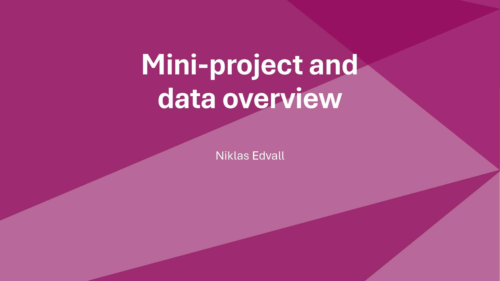
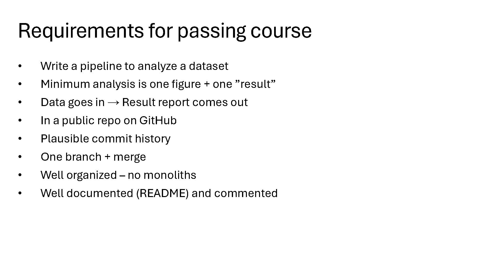
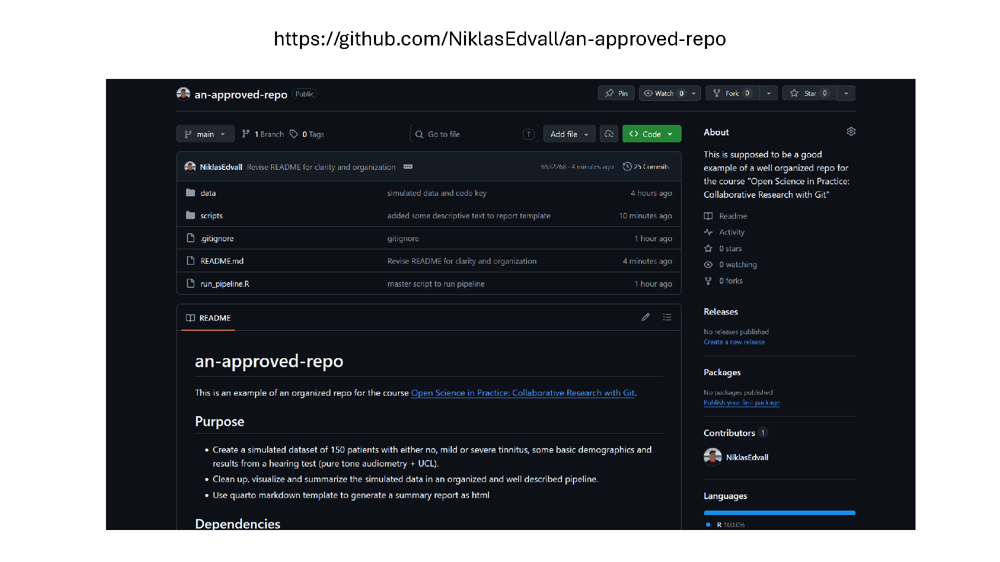
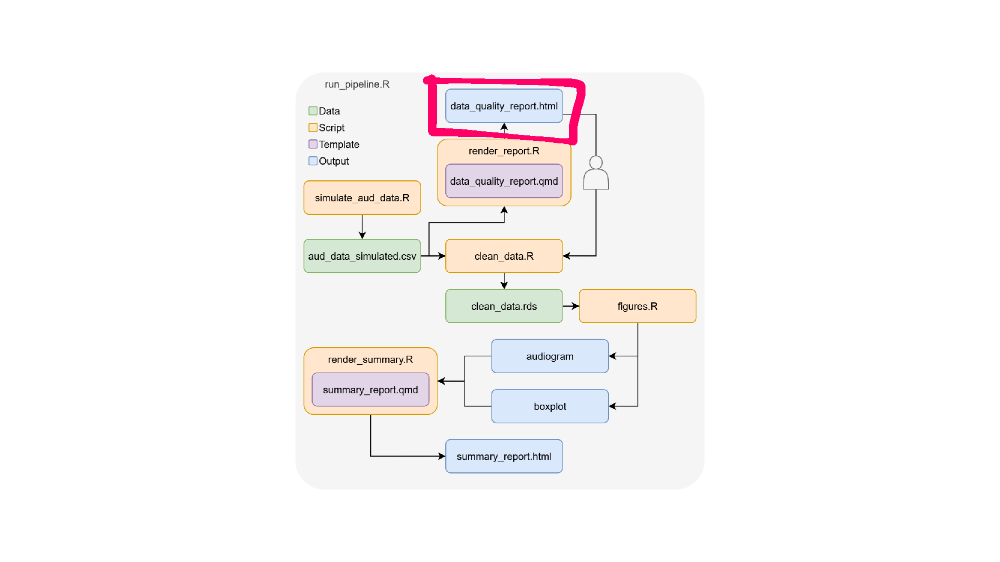
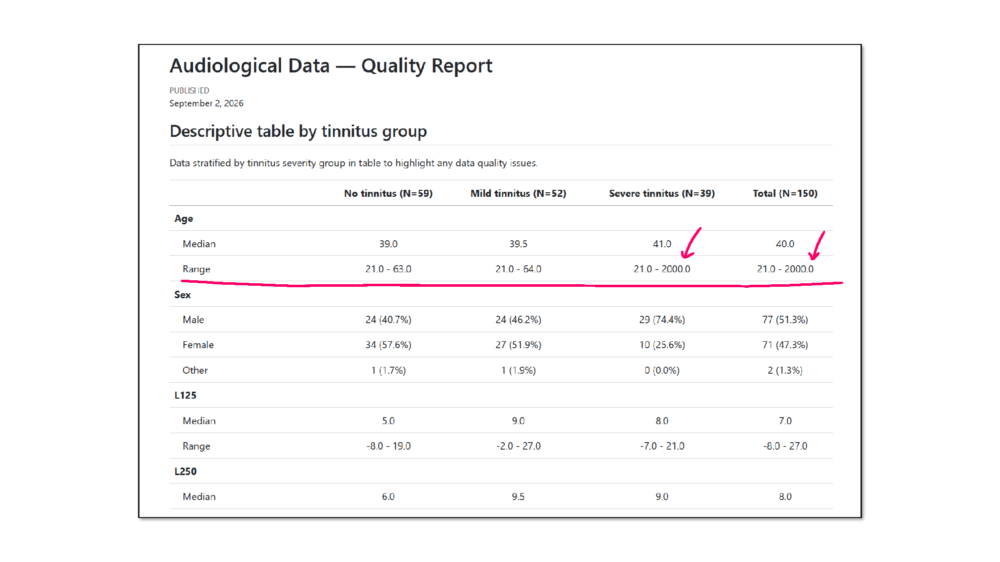
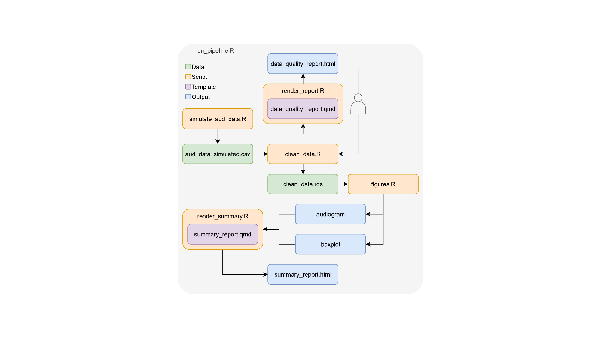
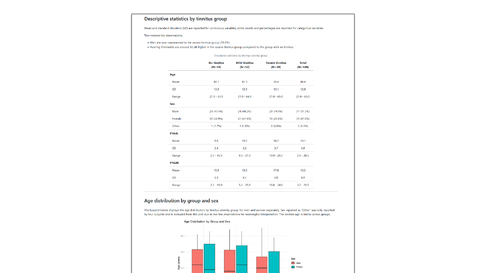
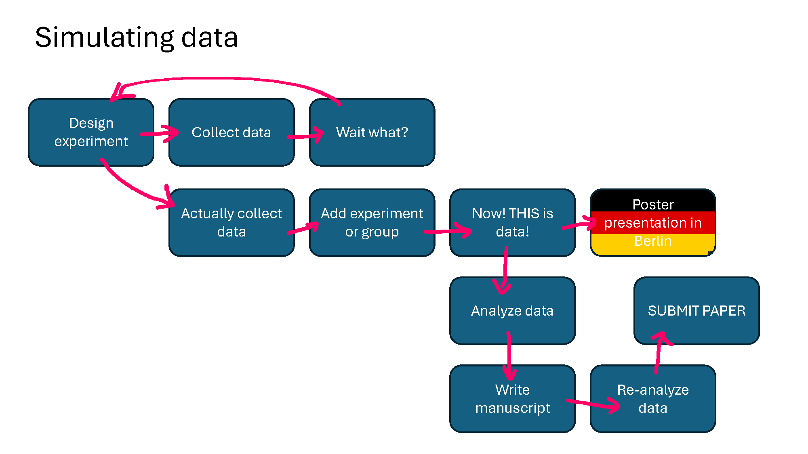
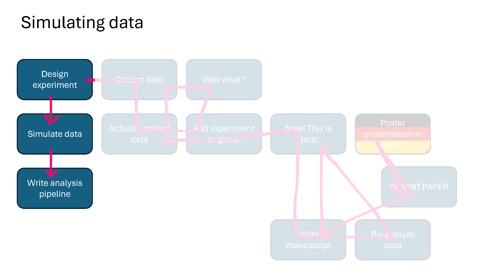
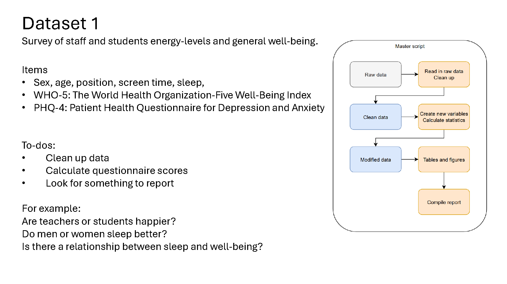
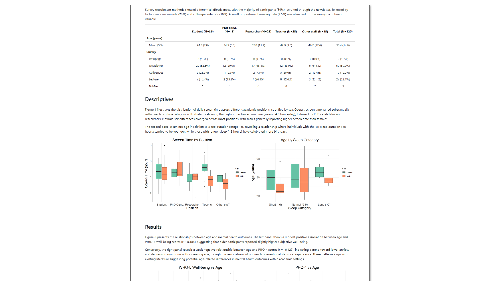
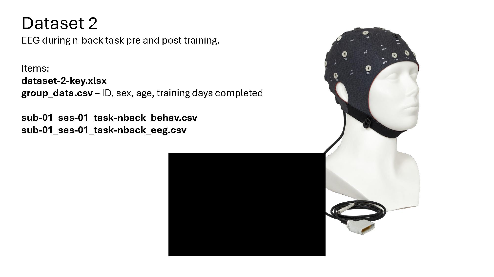

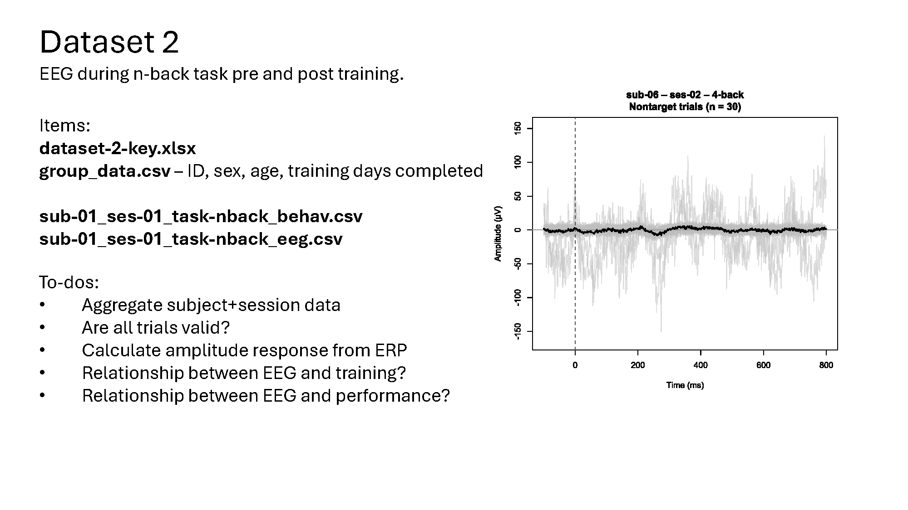
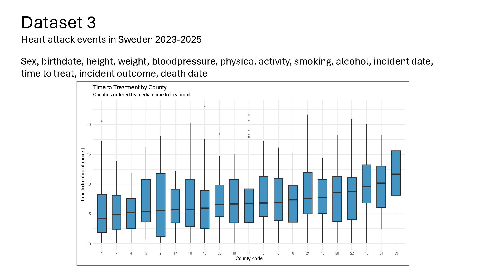
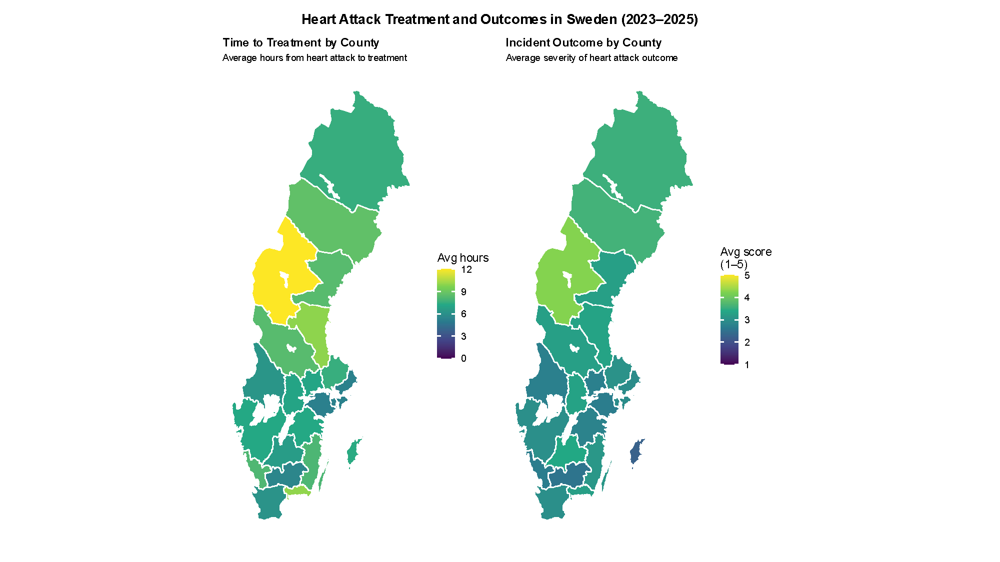
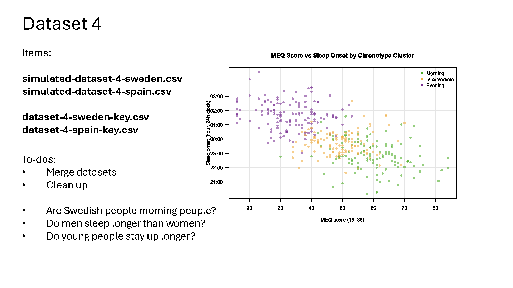
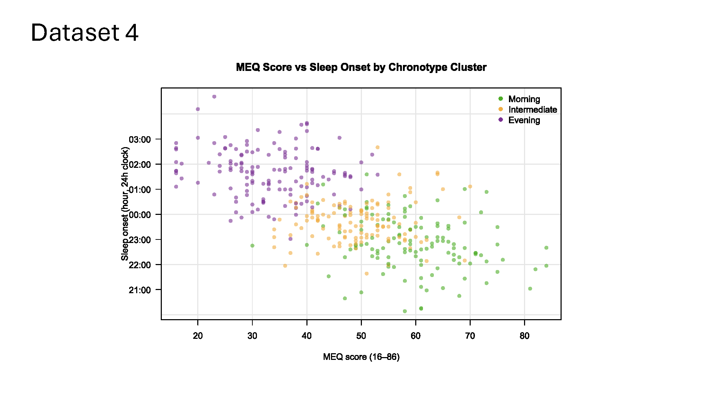

