# IDE: Positron and environment management

[Positron](https://positron.posit.co/) is a free, open-source code editor released by Posit in 2024. It is built on the VS Code engine, which means it inherits VS Code's extension ecosystem, keyboard shortcuts, settings format, and terminal integration. Because it is built on VS Code, Positron also inherits the Source Control panel — a graphical interface for the most common Git operations.

During this lecture we go through the basics of Positron and how to manage a project in on git and github via it.

Additionally, we touch on the concept on environment management: how to best manage the dependencies of your project. This is important for reproducibility and collaboration, as it allows you to specify the exact versions of packages that your project depends on.

Check the [tutorials](https://positron.posit.co/layout.html) on the posit website if you need a refresher on the basics of Positron or [the setup page](../setup/positron-setup.md) for how you install it.

[:material-file-pdf-box: Download slides (.pdf)](downloads/4-positron.pdf){ .md-button download="4-positron.pdf" }

## Slides

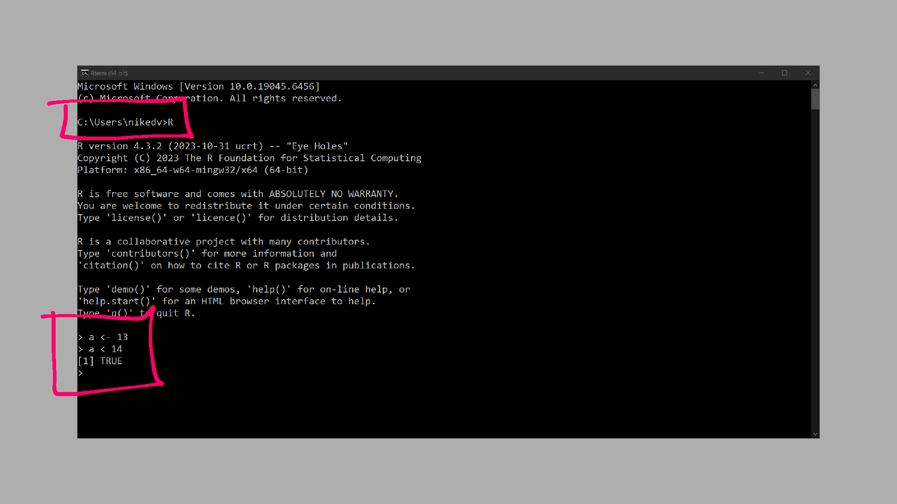
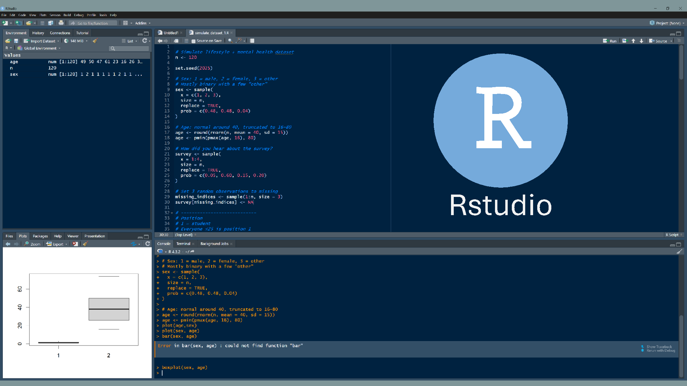
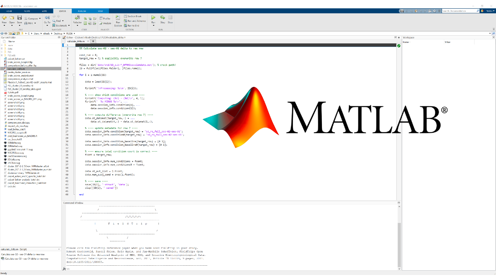
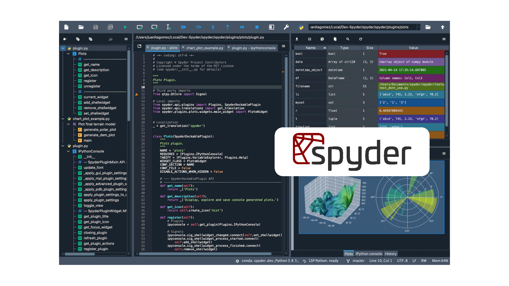

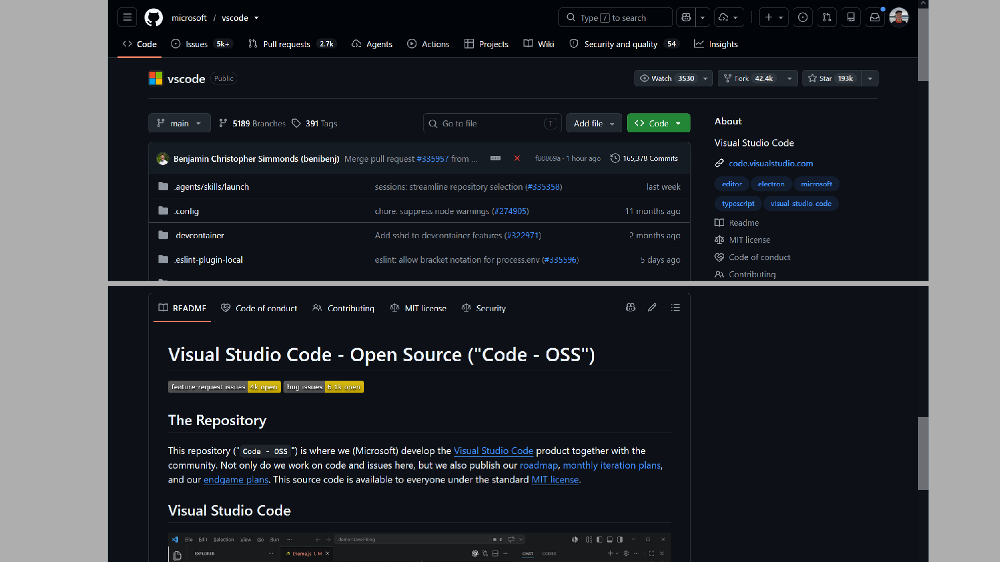
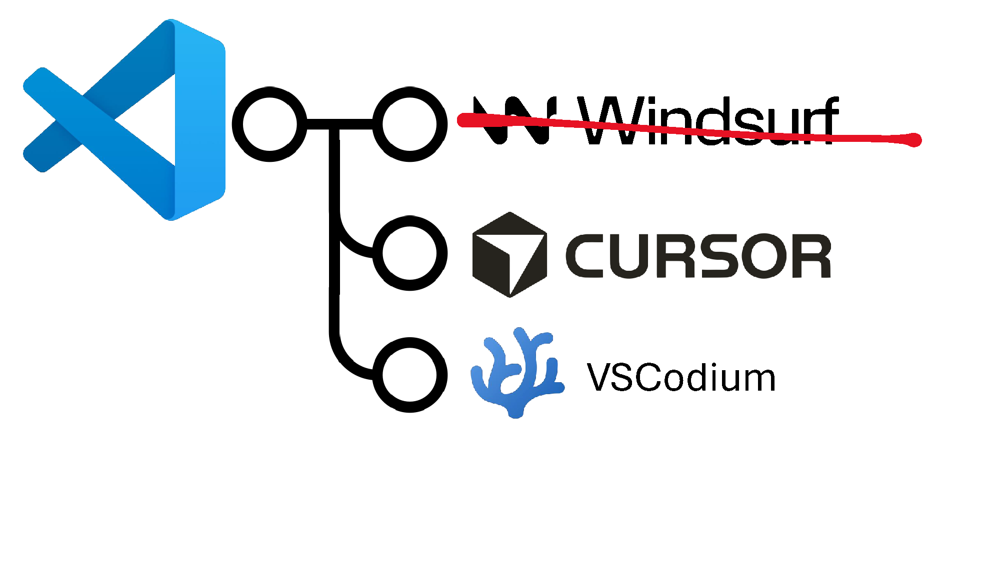

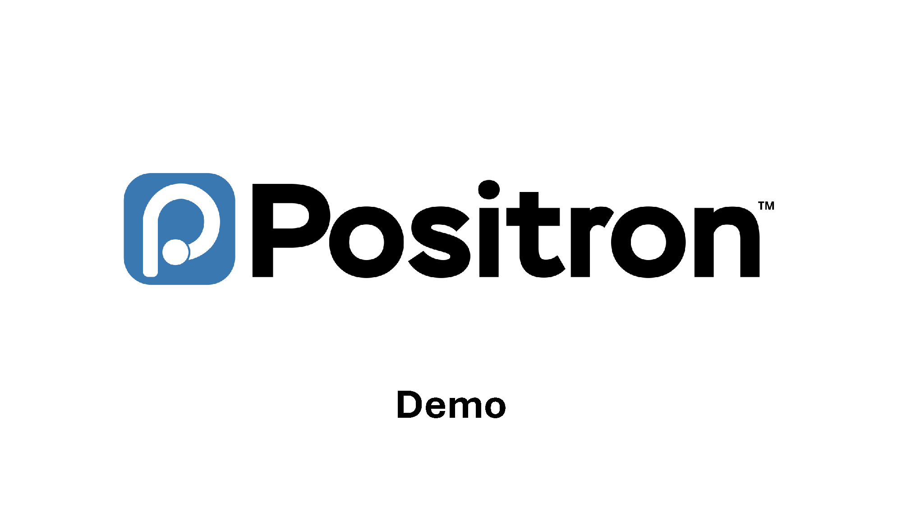
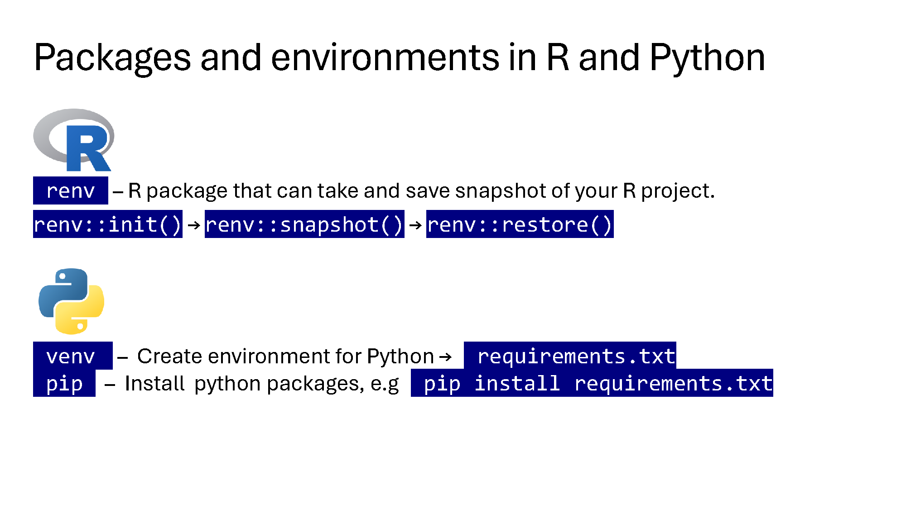
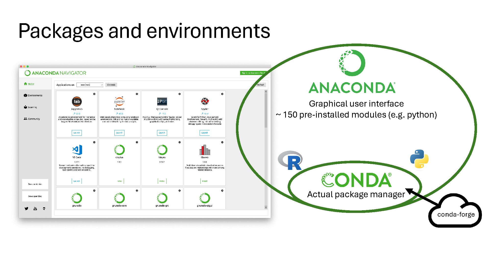
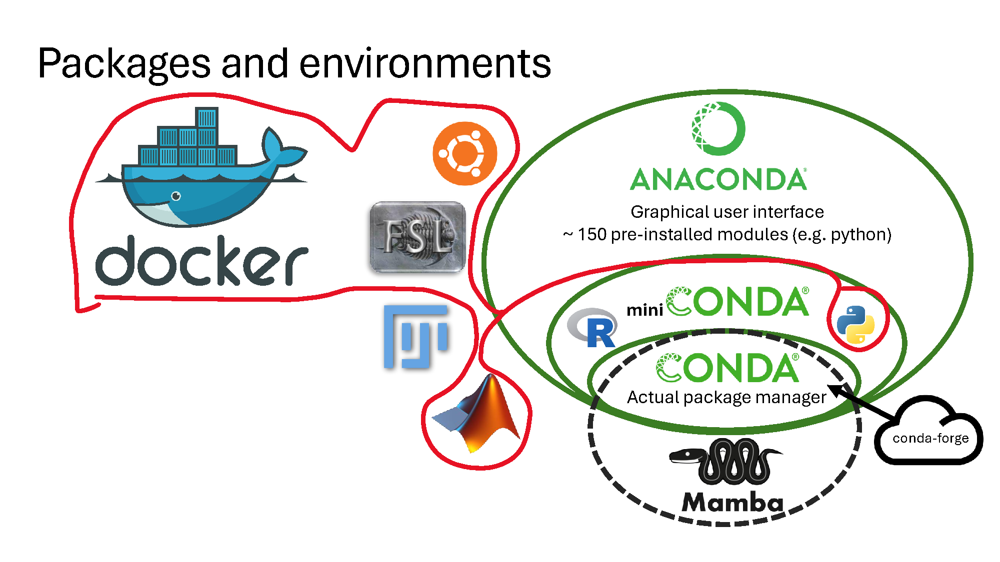
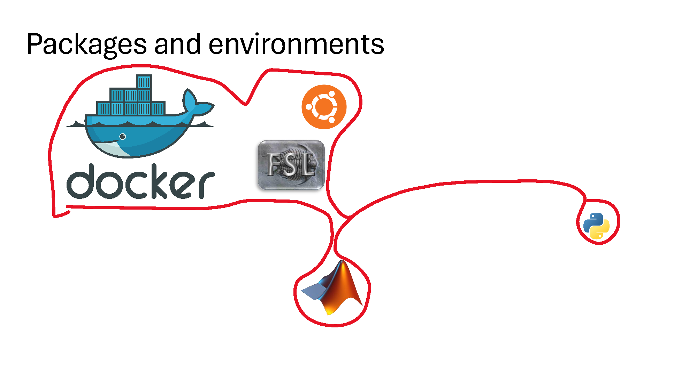
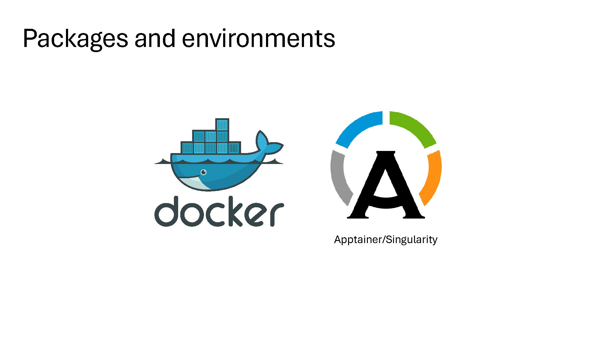
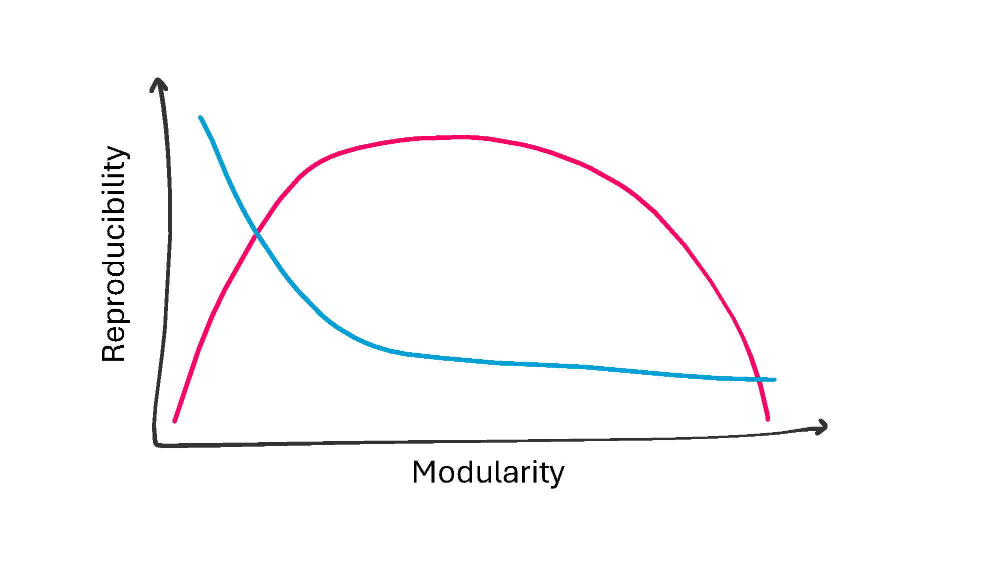
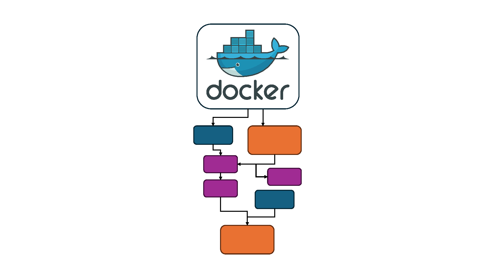

