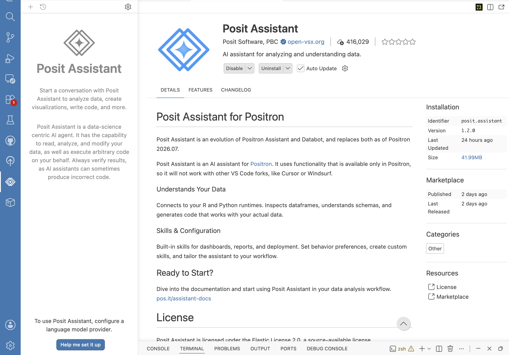
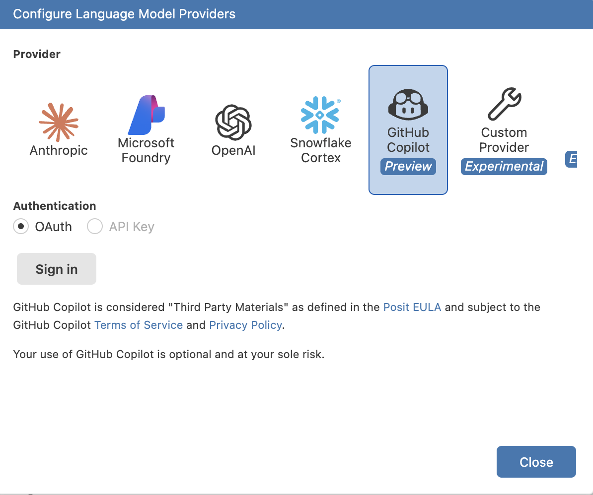

# Setup Positron

=== "Mac"

    Again you can use Homebrew to install positron

    ```sh
    brew install positron
    ```
    Or, do it manually:

    1. Go to [positron.posit.co](https://positron.posit.co/) and click **Download**.
    2. Open the downloaded `.dmg` file, drag **Positron** into your **Applications** folder.
   
    Launch Positron from Applications. If macOS shows a security dialog the first time,
        open **System Settings → Privacy & Security** and click **Open Anyway**.

=== "Linux"

    1. Go to [positron.posit.co](https://positron.posit.co/) and download the `.deb` or `.rpm`
       package that matches your distribution.
    2. Install it:

        ```sh
        # Debian / Ubuntu (.deb)
        sudo dpkg -i positron-*.deb
        sudo apt-get install -f   # fix any missing dependencies

        # Fedora / RHEL (.rpm)
        sudo rpm -i positron-*.rpm
        ```

    3. Launch Positron from your application menu or by running `positron` in a terminal.

=== "Windows"

    1. Go to [positron.posit.co](https://positron.posit.co/) and click **Download**.
    2. Run the downloaded `.exe` installer and follow the prompts, accepting the defaults.
    3. Launch **Positron** from the Start menu.

## Posit Assistant

For AI assisted coding you can link the Posit Assistant with various providers.

{width="70%"}

{width="50%" align="right"}
If you managed to create a GitHub University associated account, you have access a limited amount of tokens per month. Use them wisely.
