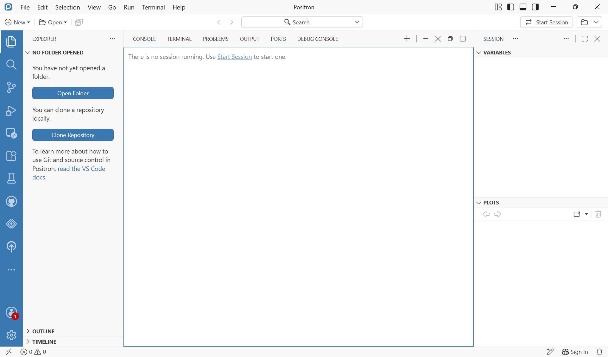
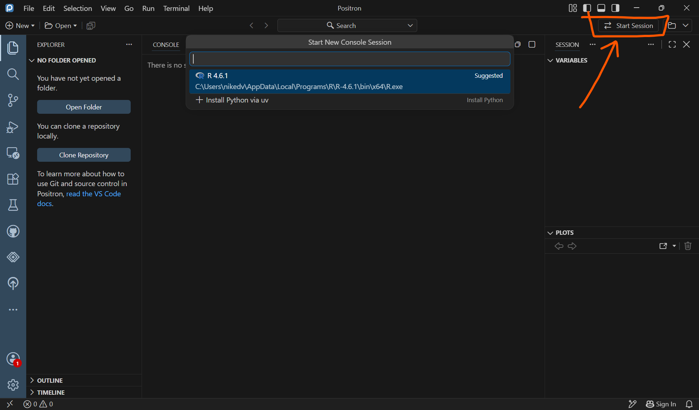

# Setup Positron

=== "Windows"
    1. Go to [positron.posit.co](https://positron.posit.co/) and click **Download**.
    2. Run the downloaded `.exe` installer and follow the prompts, accepting the defaults.
    3. Launch **Positron** from the Start menu.

=== "Mac"

    Again you can use Homebrew to install positron

    ```sh
    brew install positron
    ```
    Or, do it manually:

    1. Go to [positron.posit.co](https://positron.posit.co/) and click **Download**.
    2. Open the downloaded `.dmg` file, drag **Positron** into your **Applications** folder.
   
    Launch Positron from Applications. If macOS shows a security dialog the first time,
        open **System Settings → Privacy & Security** and click **Open Anyway**.

=== "Linux"

    1. Go to [positron.posit.co](https://positron.posit.co/) and download the `.deb` or `.rpm`
       package that matches your distribution.
    2. Install it:

        ```sh
        # Debian / Ubuntu (.deb)
        sudo dpkg -i positron-*.deb
        sudo apt-get install -f   # fix any missing dependencies

        # Fedora / RHEL (.rpm)
        sudo rpm -i positron-*.rpm
        ```

    3. Launch Positron from your application menu or by running `positron` in a terminal.


The first time you start Positron, it may ask you to sign in. You can use your GitHub account to sign in. If you do, you can run version control and push to github directly from Positron.

Positron should look something like this:


<br>
If you are one of us emo-kids, you open the options to switch to dark mode in `File → Preferences → Theme → Color theme`.

To run R in positron, click "Start session" in the top right corner and select your R version.


That's it for setting up Positron!

Later in the course we have a [lecture](../lectures/positron-lectures-1.md) with some tips and tricks for using Positron.