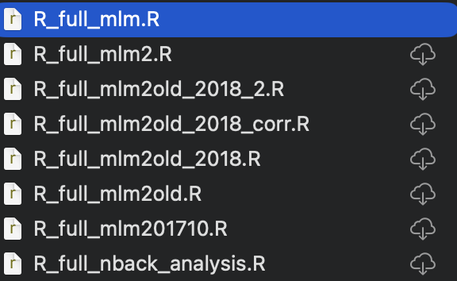
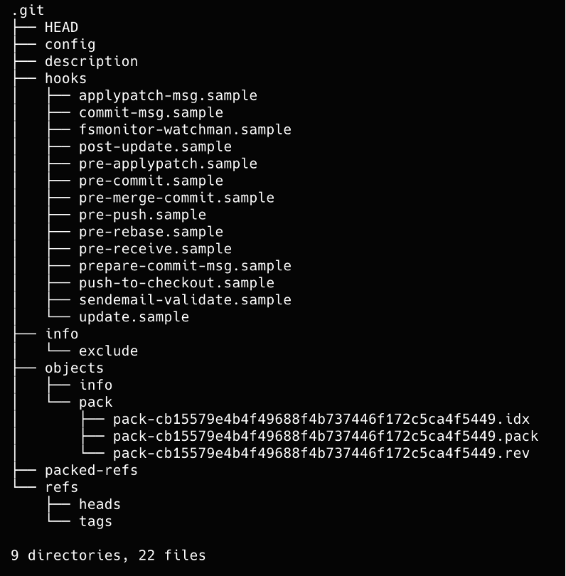

## A Short History

::: columns
::: {.column width="80%"}
- In the 1970s-1990s, version control systems were mostly centralized.
- In 2005, Git was created by Linus Torvalds for Linux kernel development.
- Git was designed to be fast, distributed, and resilient.
- Today, Git is the dominant version control system in software, data science, and open collaboration.

:::
::: {.column width="20%"}


:::
:::

## Case example

Does this look familiar?




## Why Git?

Git helps you:

- track changes over time
- recover older versions of files
- work safely before trying risky edits
- collaborate without emailing files around
- document *why* something changed, not only *what* changed


## Centralized vs Distributed

::: columns
::: {.column width="50%"}
### Centralized systems
- one main server
- clients depend on central access
- history is mainly stored centrally

:::

::: {.column width="50%"}
### Distributed systems
- every clone has the full history
- local commits work offline
- branching and merging are cheap
{width="30%"}
:::
:::


## The Core Idea: Snapshots, Not "Track Changes"

Instead of storing every file as a stream of edits, Git stores snapshots of your project.

```{mermaid}
flowchart LR
  A[Commit A<br/>report.qmd<br/>script.py<br/>data.csv] --> B[Commit B<br/>report.qmd updated<br/>script.py same<br/>data.csv same]
  B --> C[Commit C<br/>report.qmd same<br/>script.py updated<br/>data.csv same]
```

Each commit points to a project state.

## Three Main Areas

Git work usually moves through three areas:

1. Working directory
2. Staging area
3. Repository history

```{mermaid}
flowchart LR
  W[Working directory<br/>edit files] -->|git add| S[Staging area<br/>select next snapshot]
  S -->|git commit| R[Repository<br/>permanent history]
```

## Working Directory

The working directory is where you:

- write code
- edit text
- add figures
- delete files
- experiment freely

Git notices those changes, but they are not committed yet.

## Under the surface

::: columns
::: {.column width="50%"}
- Contain all snapshots of your project
:::

::: {.column width="50%"}



:::
:::

## The Staging Area

The staging area lets you decide what belongs in the next commit.

This is useful because you can:

- separate unrelated changes
- make cleaner history
- write clearer commit messages
- avoid committing accidental edits

## Commits

A commit is:

- a snapshot of the staged content
- a unique identifier (hash)
- author + timestamp metadata
- a message explaining the change
- a pointer to one or more parent commits

## Commit History as a Graph

Git history is a directed graph, not just a numbered list.

```{mermaid}
gitGraph
  commit id: "A"
  commit id: "B"
  commit id: "C"
```

## Branches

A branch is a movable label pointing to a commit.

- `main` often points to the stable default line of development
- new branches let you work on ideas without disturbing `main`
- switching branches changes the files you see in your worktree

## Branching Example

```{mermaid}
gitGraph
  commit id: "start"
  commit id: "clean data"
  branch feature-slides
  checkout feature-slides
  commit id: "add diagrams"
  commit id: "improve examples"
  checkout main
  commit id: "fix typo"
```

## Merging

Merging combines histories.

Typical pattern:

1. Create a branch for a feature or lesson.
2. Commit work on that branch.
3. Merge it back into `main` when ready.

```{mermaid}
gitGraph
  commit id: "A"
  branch feature
  checkout feature
  commit id: "B"
  checkout main
  commit id: "C"
  merge feature id: "merge"
```

## Merge Conflicts

Conflicts happen when Git cannot safely combine overlapping edits.

Common causes:

- two people changed the same lines
- one person renamed a file while another edited it
- generated or binary files changed in parallel

Conflicts are normal. They are not Git failures.

## Why Plain Text Works Best

Git works best when source files are plain text:

- `*.md`
- `*.qmd`
- `*.R`
- `*.py`
- `*.tex`
- `*.csv`

Plain text gives readable diffs, cleaner merges, and easier review.

## Why Binary Files Are Harder

Formats like these are less Git-friendly:

- `*.pptx`
- `*.docx`
- `*.xlsx`
- `*.odp`
- many image and media formats

Git can store them, but diffs and merges are much weaker.

## Local and Remote Repositories

Your local repository lives on your computer.

A remote repository is a shared copy, often on:

- GitHub
- GitLab
- Codeberg
- a university or lab server

Common flow:

1. `git clone`
2. edit locally
3. `git commit`
4. `git push`
5. collaborators `git pull`

## Typical Daily Workflow

```{mermaid}
flowchart LR
  A[Clone repository] --> B[Create or switch branch]
  B --> C[Edit files]
  C --> D[git add]
  D --> E[git commit]
  E --> F[git push]
  F --> G[Open pull request or merge]
```

## Essential Commands

```bash
git clone <url>
git status
git add <file>
git commit -m "Explain the change"
git log --oneline --graph
git branch
git switch -c <new-branch>
git pull
git push
```

## What Makes a Good Commit?

Good commits are:

- small enough to understand
- focused on one logical change
- named with a meaningful message
- easy to review and, if needed, revert

Example messages:

- `add first lecture slides on Git basics`
- `fix typo in cloning example`
- `restructure branch workflow diagram`

## Git for Research and Teaching

Git is useful for:

- lecture material and course notes
- analysis scripts
- manuscripts written in plain text formats
- data-processing pipelines
- collaboration between supervisors, students, and lab members

## Git Is Not Only for Programmers

Git is especially valuable whenever work is:

- iterative
- collaborative
- text-based
- reproducible
- worth documenting over time

## Mental Model to Remember

Think of Git as:

- a timeline of snapshots
- with labels called branches
- and safe ways to combine work from different people

## Take-Home Messages

- Git records history as snapshots.
- Commits are the building blocks of that history.
- Branches let you experiment safely.
- Merges combine parallel work.
- Plain-text sources are the most Git-compatible.
- Git is a core tool for open, collaborative, reproducible work.

## Next Step

After this introduction, the next practical topic is usually:

- creating a repository
- checking `git status`
- making a first commit
- reading the history graph
